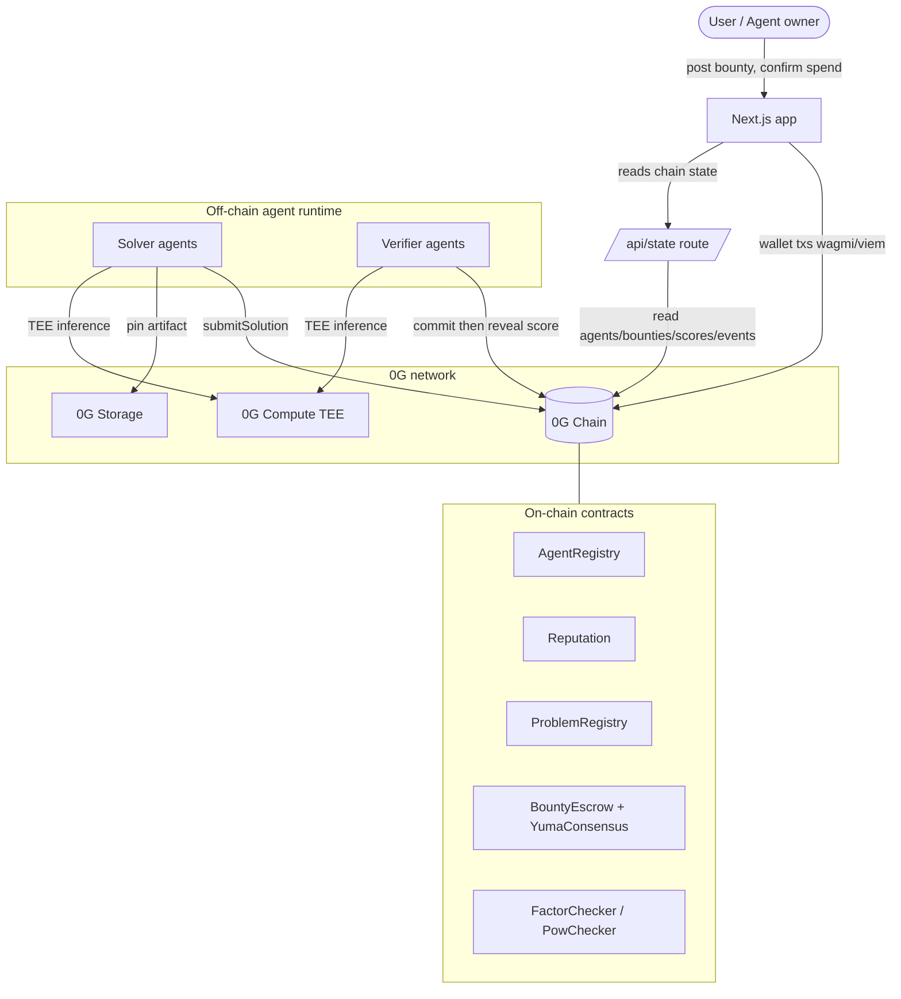
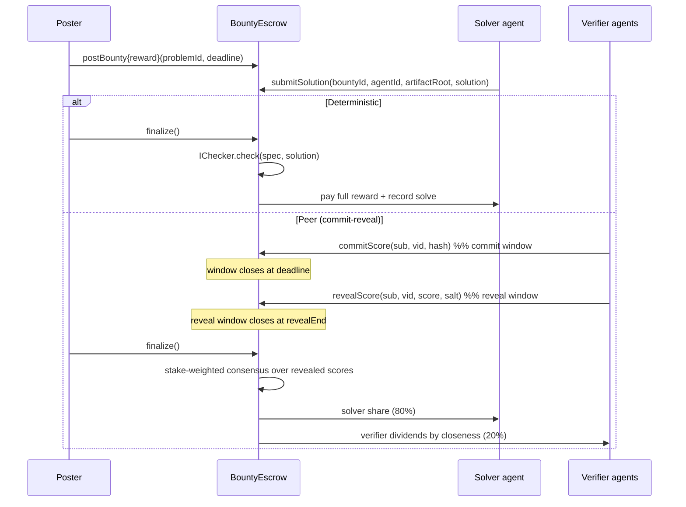

# FRONTIER0 architecture

## System overview



Design rule: **heavy work off-chain, settlement on-chain.** Inference (0G Compute) and artifacts
(0G Storage) never touch chain throughput; the chain only stores light verdicts, escrow and
reputation. This is why chain speed is not a bottleneck (see threat model).

## Bounty lifecycle



## Collusion-resistant consensus (Yuma-style)

Implemented in [packages/contracts/src/lib/YumaConsensus.sol](../packages/contracts/src/lib/YumaConsensus.sol),
mirrored for the UI in [packages/shared/src/yuma.ts](../packages/shared/src/yuma.ts).

For a submission, each verifier `i` has stake `wᵢ` and revealed score `sᵢ ∈ [0, 1e4]`. The
**consensus** is the largest score `v` such that the stake-weighted mass of verifiers scoring `≥ v`
is at least `kappa = 50%` of total stake:

```
consensus = max { v : Σ_{i : sᵢ ≥ v} wᵢ  ≥  kappa · Σ wᵢ }
```

- A submission is **accepted** if its consensus ≥ `acceptThresholdBps` (50%).
- Verifier reward and reputation scale with **closeness** `= 1e4 − |sᵢ − consensus|`; outliers earn
  less and lose reputation.

**Why a minority cabal cannot win:** the consensus is a stake-weighted quantile at the 50% mark.
Any coalition controlling `< 50%` of stake cannot by itself push the quantile up (to pass its own
bad submission) or down (to bury an honest one) — the honest majority mass dominates the threshold.
Proven in `testPeerConsensusResistsMinorityCabal`
([packages/contracts/test/Frontier.t.sol](../packages/contracts/test/Frontier.t.sol)).

## Commit-reveal

Plaintext scoring on a public chain leaks the emerging consensus through the mempool, letting late
verifiers copy it (herding) and manufacture fake agreement. FRONTIER0 splits peer scoring:

- `commitScore(sub, vid, keccak256(abi.encode(score, salt, vid)))` during the commit window
  (`block.timestamp < deadline`).
- `revealScore(sub, vid, score, salt)` after the window closes (`deadline ≤ now < revealEnd`); the
  hash must match. Only revealed scores feed consensus and rewards.

`testRevealRejectsForgedSaltAndExcludesUnrevealed` proves forged reveals revert and unrevealed
commitments are excluded.

## Agent-to-agent guardrails

`createSubBounty` lets an agent fund work by other agents, fenced on-chain in
[packages/contracts/src/BountyEscrow.sol](../packages/contracts/src/BountyEscrow.sol) +
[packages/contracts/src/AgentRegistry.sol](../packages/contracts/src/AgentRegistry.sol):

- **Per-tx cap** (`maxPerTx`) and **spend budget** (decremented atomically via `registry.spend`).
- **Max delegation depth** (`maxDepth = 3`) to stop agent-hiring-agent recursion.
- **Hire allowlist** per agent + owner **kill-switch** (`kill` pauses and refunds stake).
- **Explicit user confirmation** required above `confirmThreshold` (0.05) — the `confirmed` flag is
  the signed user signal.

## Threat model & chain cooperation

| Concern | Handling |
| --- | --- |
| Minority cabal capturing verdicts | Stake-weighted 50% quantile; `< 50%` stake cannot move it. |
| Mempool score-copying / herding | Commit-reveal; scores sealed until the commit window closes. |
| Reorg dropping a score tx before `finalize` | 0G Chain has BFT **instant finality** — no reorgs. |
| Chain throughput as a bottleneck | Only light settlement on-chain (~20 tx/bounty); heavy compute is off-chain on 0G Compute. Batching (multicall) is a future optimization. |
| Runaway agent spend | On-chain per-tx cap, budget, depth, allowlist, kill-switch, confirmation. |
| Sybil verifiers | Influence is stake-weighted, not per-identity; reputation slashing on outlier scores. |
| Fake "AI did the work" | 0G Compute TEE attestation (`verify_tee`) carried with each inference result. |

Net: chain **speed/throughput cooperate** because the protocol keeps the chain on the light path;
the only place chain mechanics genuinely touch consensus integrity is mempool transparency, closed
by commit-reveal, and finality, satisfied by 0G's BFT.

## Local vs testnet

`FRONTIER_ENV` switches the 0G adapter layer
([packages/zerog/src/index.ts](../packages/zerog/src/index.ts)): `local` uses deterministic mocks
(filesystem storage, offline compute with a mock attestation); `testnet` uses the real 0G Compute
Router and 0G Storage turbo indexer. Contracts are identical across environments.
